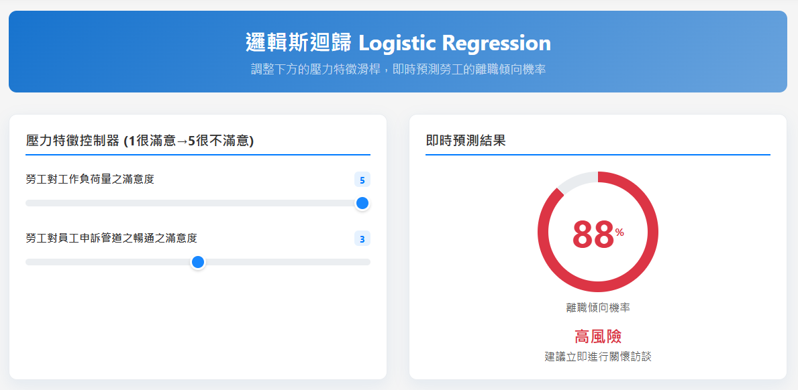
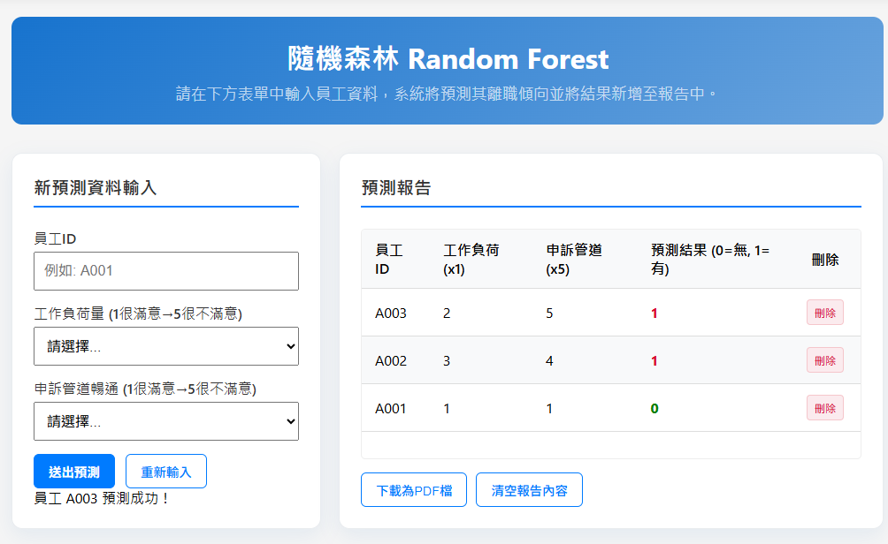

# 台灣六都工作壓力對離職傾向預測

   

> **運用機器學習模型，協助企業提前識別高風險離職群體，降低人力流失成本。**

## 📖 專案概述

本專案旨在解決企業面臨的高離職率問題。透過分析勞動部「勞工生活及就業狀況調查」數據，針對台灣六都（特別聚焦於北北桃地區）的勞工進行工作壓力與離職傾向的關聯分析。

我們建立了一套端對端的機器學習應用，從數據清洗、特徵工程、模型訓練到 Web 系統部署。最終模型能有效預測勞工的離職傾向機率，並提供視覺化報表作為 HR 決策的輔助工具。

### 🏆 關鍵成果
* **預測成效：** 模型 **Recall (召回率) 達 0.83**，能精準找出超過八成的潛在離職者。
* **商業價值：** 識別出「工作負荷量」與「申訴管道暢通度」為離職最關鍵因子，提供具體的管理改善方向。

---

## 💻 系統介面展示




* **輸入介面：** 使用者可透過控制滑桿或表單系統，輸入勞工壓力特徵數值。
* **預測結果：** 系統即時計算該勞工離職傾向機率或分類結果。
* **[👉 點擊查看 Live Demo https://ml-project-turnover-intention.onrender.com/ ]**

---

## 🛠️ 使用技術

| 領域 | 技術與工具 |
| :--- | :--- |
| **語言與核心** | Python 3.10 |
| **資料處理** | Pandas, NumPy, Excel Power Query |
| **機器學習** | Scikit-learn (Logistic Regression, Random Forest), Matplotlib, Seaborn |
| **Web 後端** | Flask (Python Web Framework) |
| **Web 前端** | HTML5, CSS3, JavaScript, Chart.js |
| **系統建模** | StarUML (繪製強韌分析圖) |
| **部署環境** | Render Cloud |

---

## ⚙️ 機器學習流程

本專案遵循 MLOps 開發流程，重點策略如下：

### 1. 資料前處理與挑戰
* **資料來源：** 勞動部「勞工生活及就業狀況調查」。
* **挑戰 (Challenge)：** 原始數據存在嚴重**類別不平衡 (Imbalanced Data)**，離職傾向樣本僅佔 15.3%。
* **解決方案：**
    * 設定 `class_weight='balanced'` 讓模型加權關注少數類別。
    * 使用分層抽樣 (`stratify=y`)，確保訓練/測試集分佈一致。

### 2. 模型選擇與優化
* **演算法評估：** 測試過線性迴歸、決策樹，最終選擇 **邏輯斯迴歸 (Logistic Regression)** 為基準模型，**隨機森林 (Random Forest)** 為主力模型。
* **特徵工程：** 透過相關性分析，將特徵從 5 個簡化為 **2 個關鍵特徵**（工作負荷量、申訴管道），有效降低雜訊並提升運算效率。

### 3. 模型表現
針對「北北桃」地區資料進行再訓練後的最終數據：
* **AUC Score:** 0.79
* **Recall (召回率):** 0.83 (本專案最重視的指標，寧可誤判也不要漏抓潛在離職者)

---

## 📊 商業洞察與建議

基於模型分析結果，我們發現影響離職的兩大主因，並對企業提出以下建議：

1.  **工作負荷量 (Workload):** 是離職的最大推力。建議企業應定期檢視人力配置，並推動流程自動化以降低過勞風險。
2.  **申訴管道 (Grievance Channels):** 透明且暢通的申訴管道能顯著降低離職意圖。建議建立匿名回饋機制，提升勞工安全感。

---

## 🔮 未來展望

* 納入更多影響因子（如：生活平衡滿意度、年資職級）。
* 針對不同產業類別（如科技業 vs 服務業）訓練專屬模型，提升精確度。
* 增加 RAG (檢索增強生成) 功能，讓 AI 根據預測結果自動生成個人化的留才建議書。

---

## 📂 專案結構 (File Structure)

```text
ml_project_1108/
├── app.py                  # Flask 主應用程式入口
├── logistic_regression/    # 邏輯斯迴歸相關代碼
├── random_forest/          # 隨機森林相關代碼
├── models/                 # 存放訓練好的模型 (.joblib) 與資料集 (.csv)
│   ├── logistic_model.joblib
│   ├── rf_model.joblib
│   └── turnover_data.csv
├── static/                 # 靜態檔案 (CSS, JS, Chart.js)
├── templates/              # HTML 頁面 (Index, Result pages)
└── requirements.txt        # 專案依賴套件清單
